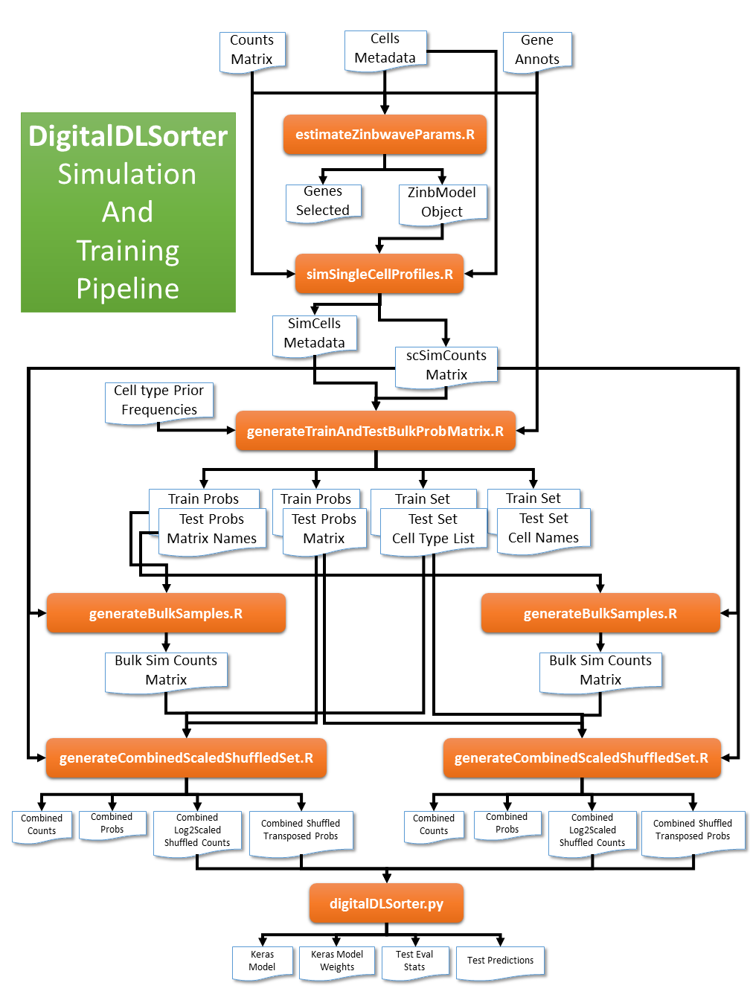

# digitalDLSorter
A pipeline to generate a Deep Nerual Network cell type deconvolution model for bulk RNASeq samples from single cell experiment data

# Installation
The pipeline runs in R 3.51 and python 3.6.8.

Install R with the following packages: 
- splatter
- zimbwave
- SingleCellExperiment
- Matrix
- dplyr
- gtools
- ggplot2
- resahpe2
- edgeR
- pbapply
- optparse

Install Python 3 with the following packages:
- numpy
- pandas
- argparse
- matplotlib
- keras

Using conda enviroment:
```
conda create env -n digitalDLSorter
conda install python=3.6.8 numpy pandas argparse matplotlib keras
conda install r=3.5.1 bioconductor-splatter bioconductor-zinbwave bioconductor-SingleCellExperiment r-gtools r-dplyr r-ggplot2 r-reshape2  bioconductor-edgeR r-pbapply r-optparse
```

# Pipeline summary



# Running the pipeline

Each srcipt has its own help instructions.

